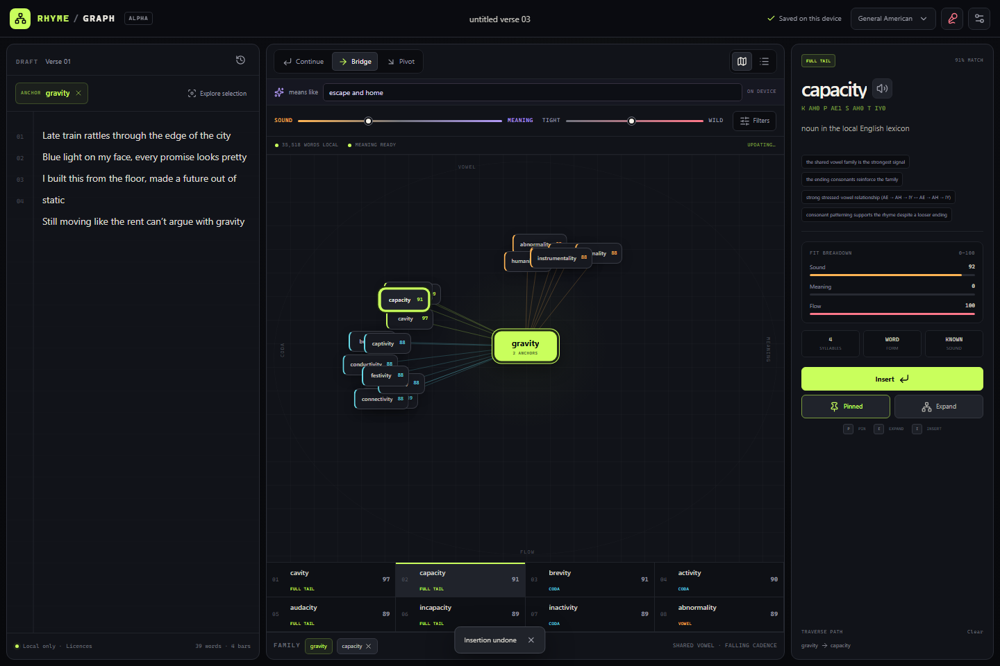

# RhymeGraph

RhymeGraph v0.2.0 is a local-first writing instrument for exploring rhyme as a neighbourhood rather than a lookup table. It combines stress-aware phonetic matching, assonance, consonance, slant rhyme, cadence, multi-word phrases, and optional semantic similarity in an interactive graph.

Nothing typed into the studio is sent to a rhyme service. The pronunciation lexicon and search worker run in the browser. The locally hosted MiniLM model and inference runtime also run in the browser, but are fetched only after an explicit meaning action; a sound-only session requests neither the model nor its WASM runtime.

**[Open the live studio](https://sjmakin.github.io/RhymeGraph/)**



## Run it

Requires Node.js 22.13 or newer.

```bash
npm ci
npm run dev
```

Open `http://localhost:3000`.

The repository is a static Next.js application. `npm run build` creates the export in `out/`, and `npm start` serves that export locally.

## GitHub Pages

The Pages workflow builds and browser-tests the app at its real repository subpath before publishing it. In the repository settings, choose **Pages → Source → GitHub Actions** once; later pushes to `main` deploy automatically.

```bash
npm run test:pages  # exercise the /RhymeGraph production path locally
```

For a manual post-deploy audit, set `PLAYWRIGHT_BASE_URL=https://sjmakin.github.io` and `PLAYWRIGHT_BASE_PATH=/RhymeGraph`, then run `npm run test:browser`. Supplying the external URL disables the local development server; tests run against the live deployment.

## Useful commands

```bash
npm run data:build   # rebuild the compact, browser-ready pronunciation lexicon
npm run workers:build
npm test             # engine, data, evidence, and research-session checks
npm run test:site    # production build plus end-to-end browser checks
npm run test:pages   # GitHub Pages subpath build plus the same browser checks
npm run evaluate     # write the provisional labelled-pool comparison report
npm run evaluate:check
npm run benchmark:sound
npm run benchmark:sound:check
npm run benchmark:browser
npm run lint
```

Evaluation and benchmark reports are written under the ignored `outputs/` directory. They include dataset/runtime revisions and environment context; treat them as local evidence, not portable performance claims.

## How the search works

- A phonetic worker loads the compact CMU pronunciation data and scores candidates with stress-aware sequence alignment.
- Separate vowel, consonant, coda, tail, and cadence signals allow loose relationships to surface without collapsing everything into noise.
- Continue, Bridge, and Pivot intents adjust ranking for direct continuation, semantic movement, or surprising sound-adjacent ideas.
- Up to five total anchors—the active word plus as many as four pins—describe a rhyme family instead of forcing every search through one word.
- A locally hosted `all-MiniLM-L6-v2` model can rerank candidates by meaning. It loads only when the writer enables meaning, chooses Bridge, or raises the meaning balance; that preference is remembered locally. If it cannot initialize, the studio stays fully usable in sound-only mode.

## Interaction

- Select a word in the draft, or place the caret inside it, to make it the anchor.
- Click a result to inspect why it fits; double-click a graph node or press `E` to traverse from it.
- Press `P` to pin the selected word, `I` to insert it, and `Ctrl/Cmd+Z` to undo the last insertion.
- Use Bridge with a concept such as “escape” or “home” to blend phonetic and semantic fit.
- Choose **Start research session** to begin explicit capture for the current page session. **Export research session** downloads a versioned JSON record of anchors, concepts, candidate actions, settings, and timings; **Clear & stop** removes the session capture. It uses session storage, excludes the full draft, project title, and cursor positions, and never uploads anything.

## Evidence and release guardrails

- The versioned development harness contains 25 provisional, machine-assisted development fixtures spanning all three intents plus multi-pin and five-anchor work. It compares a stressed-vowel/suffix baseline with the current phonetic scorer over a labelled candidate pool.
- The fixture grades have zero human reviewers. This is evaluator plumbing and phonetic development evidence only—not a test of Bridge semantic quality. There is no held-out split, independent review, full-vocabulary retrieval measurement, or product-quality claim yet.
- Production checks cover the root and GitHub Pages paths, Chromium plus Firefox/WebKit sound-loop smoke coverage, keyboard operation, lightweight accessibility assertions, same-origin runtime requests, and semantic-worker failure with a preserved sound path.
- `npm run benchmark:sound` writes a versioned Node lexicon/search report. `npm run benchmark:browser` writes cold and repeat production-runtime readiness, worker-inclusive encoded-response byte observations, and available renderer heap; those bytes are not full wire-transfer totals.

## Current limits

- The pronunciation pack is labelled General American (`en-US`); it is not a universal model of English or rap dialects.
- The shipped phrase pack has eight authored examples. Unknown single words are reported rather than assigned a guessed pronunciation.
- Enabling meaning transfers roughly 46 MiB of uncompressed model/runtime assets. The explicit choice is remembered in local browser storage; disabling it returns to sound only.
- On GitHub Pages, persisted drafts and the meaning preference use origin-scoped localStorage, while an active research session uses per-tab sessionStorage. Neither storage API is isolated by the `/RhymeGraph` path from other pages served at the same `sjmakin.github.io` origin.
- The graph is a stable star projection of the current ranked neighbourhood. It is not a corpus-wide embedding graph, a k-means map, or a candidate-to-candidate similarity graph.
- Search still scans all 35.5k entries. A 30-pass reference candidate on an i7-7500U observed 1.03 s median and 3.30 s p95 exhaustive-query latency, so indexed retrieval—not another surface feature—is the next engine priority.
- Ranking evidence remains provisional. Independent judgements, deeper Bridge/Pivot coverage, a frozen held-out split, and target-writer sessions are still required.

See the [product and technical specification](./SPEC.md), [implementation status](./docs/STATUS.md), [implementation diary](./docs/IMPLEMENTATION_DIARY.md), and [evidence-led roadmap](./docs/ROADMAP.md). Data and model attribution is recorded in [THIRD_PARTY_NOTICES.md](./THIRD_PARTY_NOTICES.md).
